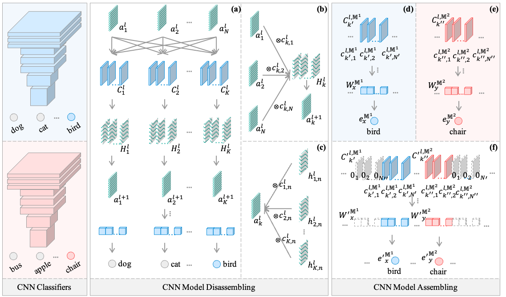

# CNN LEGO: Disassembling and Assembling Convolutional Neural Networks

### Environment

+ Python: 3.8
+ GPU: NVIDIA A40 / Quadro P6000

### Command

* Training a pre-trained model:
> bash scripts/train.sh

* Test a model:
> bash scripts/tesh.sh

* Before disassembling & assembling:
> bash scripts/sample_sift.sh  

* Component Locating:
> bash scripts/component locating.sh

* Model Disassembling:
> bash scripts/model_disassemble.sh

* Contribution Rescaling:
> bash scripts/model_rescale.sh

* Model Assembling:
> bash scripts/model_assemble.sh

* Decision Route Visualization:
> python core/model_route_visualize.py

### Code Description

* configs: some important configurations.
* models: CNN classifiers.
* loaders: data loaders.

