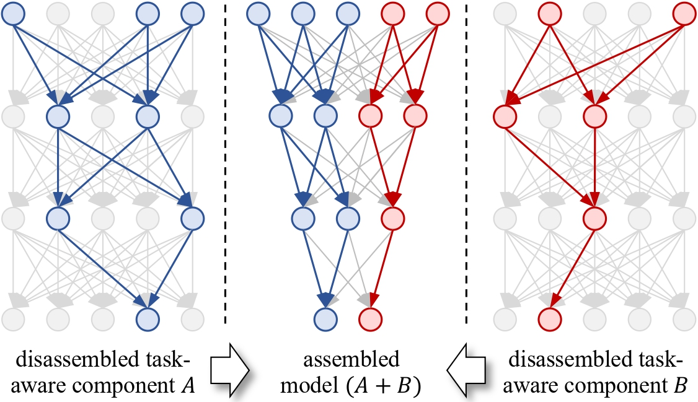
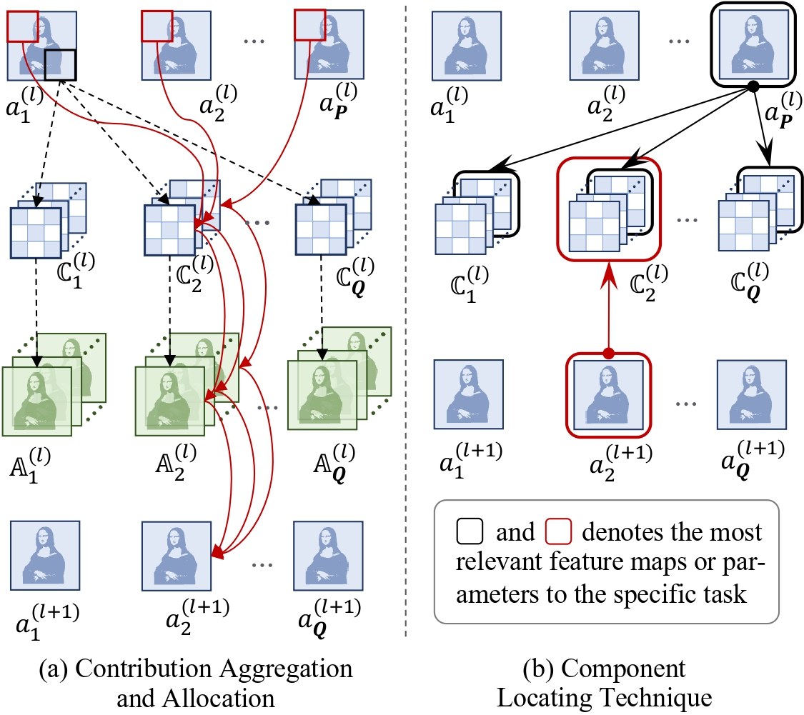
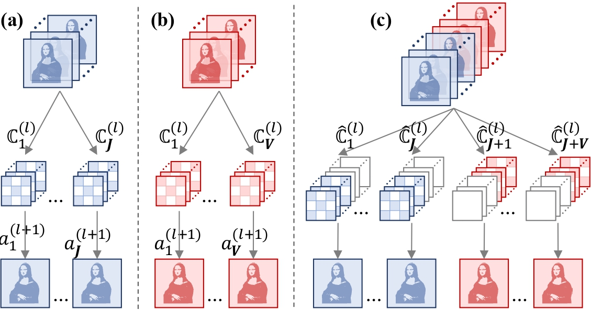

# CNN LEGO: Disassembling and Assembling Convolutional Neural Networks

## Requirements

+ Python version: 3.9
+ PyTorch version: 2.0.1
+ GPU: NVIDIA RTX A6000 / NVIDIA A40

## Quick Start
### Prepare The Source Models

* Training a pre-trained model:
> bash scripts/train.sh

* Test a model:
> bash scripts/tesh.sh

### Model Disassembling

* Before disassembling & assembling:
> bash scripts/sample_sift.sh  

* Component Locating:
> bash scripts/component locating.sh

* Model Disassembling:
> bash scripts/model_disassemble.sh

### Model Assembling

* Contribution Rescaling:
> bash scripts/model_rescale.sh

* Model Assembling:
> bash scripts/model_assemble.sh

### Others
* Decision Route Visualization:
> python core/model_route_visualize.py